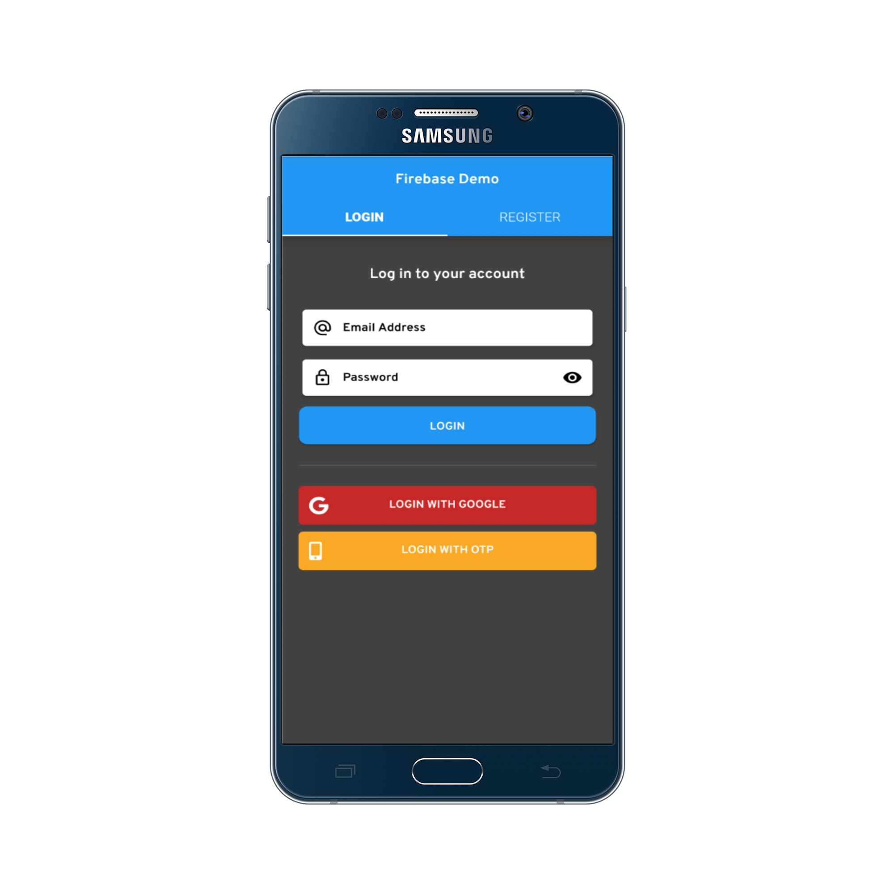
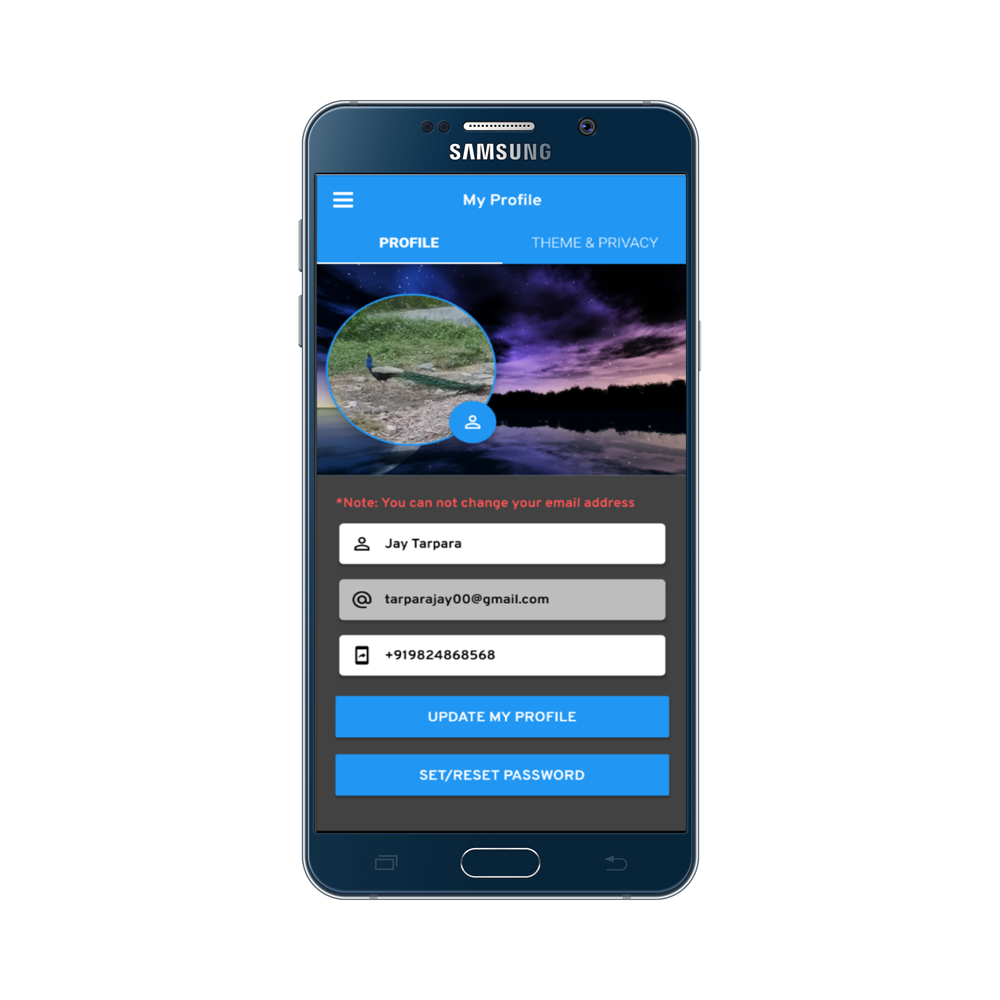
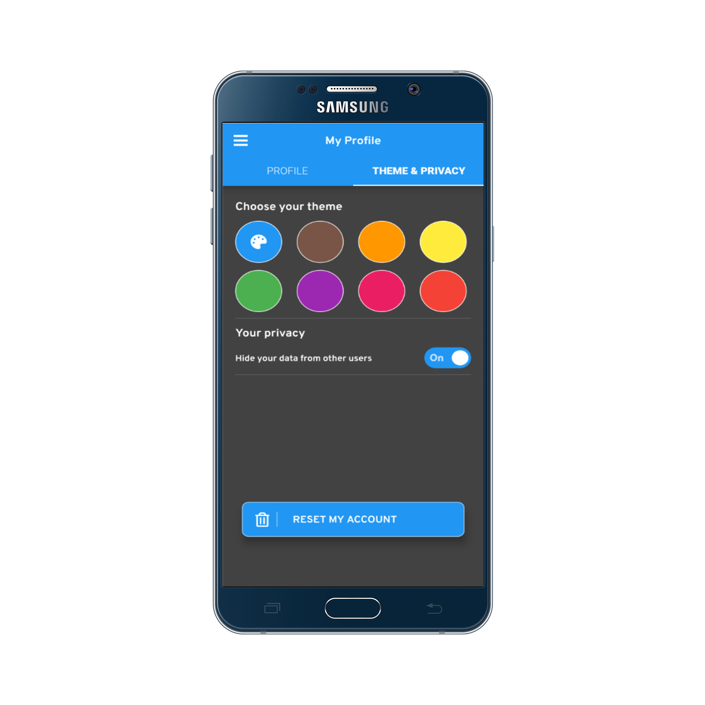
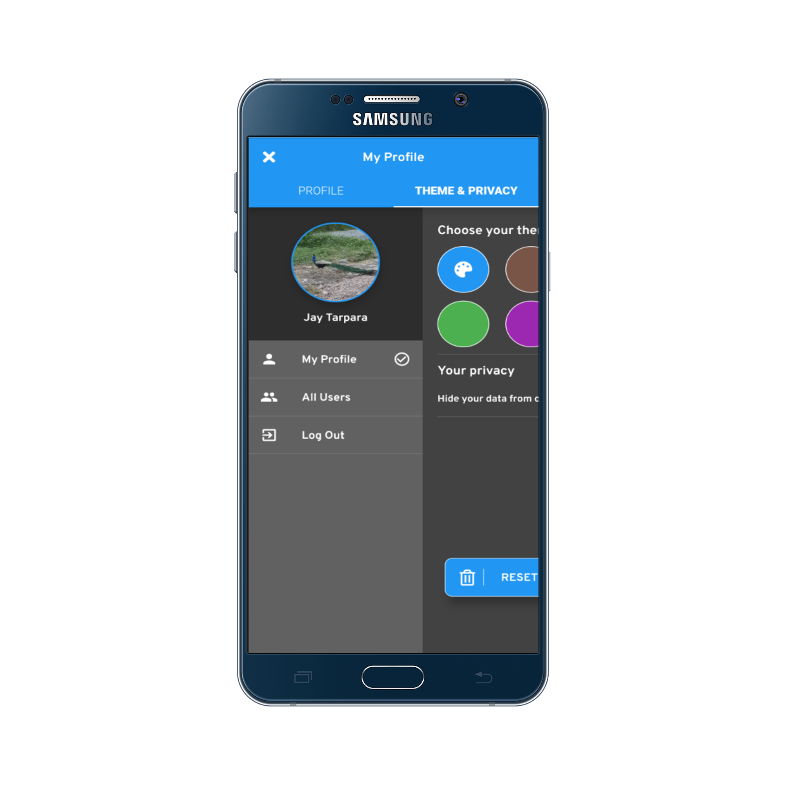
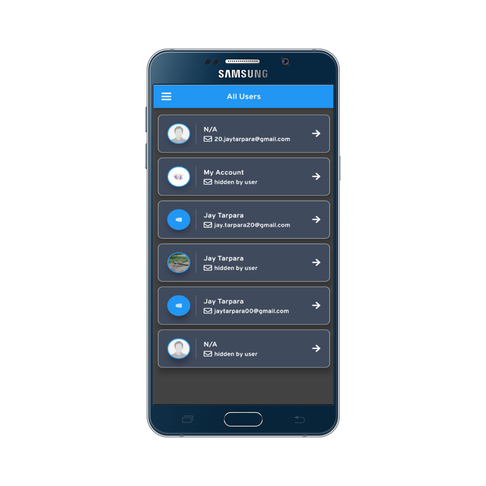
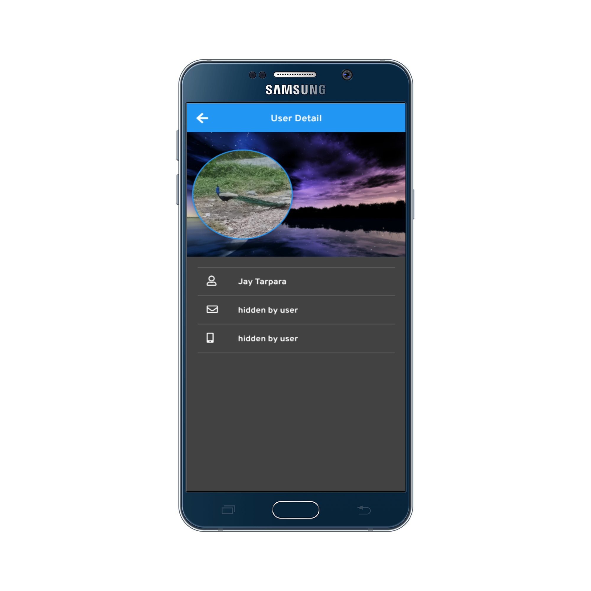
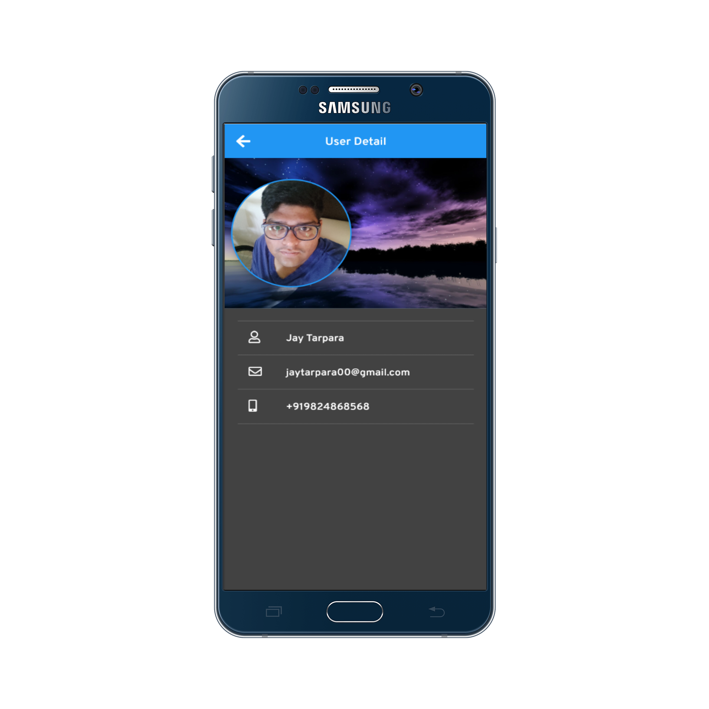

# Firebase Demo Application

     

<h4 align="center">
 📱 Firebase Demo Application - Firebase starter app made with ❤️ in Flutter 👨🏽‍💻
</h4>

 
 

    <h3>Features available in the application:</h3>
    👉🏼 Register/Login with Google account, Mobile OTP and normal email
	 
    👉🏼 Save user information in firestore
	 
    👉🏼 Upload profile picture, crop picture functionality and store in firestore
	 
    👉🏼 Theme customization
	 
    👉🏼 See other users available in the application
	 
    👉🏼 User privacy ⁃ If user don't want to show their personal data such as email and mobile number, they can choose this from privacy setting
	 
    👉🏼 Push notification and in-app messaging with firebase
	 

 
 
 

    <h3>Steps to start:</h3>
	👉🏼 Create project from firebase console and download package json file to android/app folder
	 
	👉🏼 Go to authentication tab (Sign-in method) and enable Email/password, Phone and Google method
	 
	👉🏼 also you need Support Email and SHA-1 as well as SHA-256 in your app
	 
	👉🏼 Please add SHA-1 as well as SHA-256 for release using jsk file otherwise google auth will not work when app will be in release mode
	 
	👉🏼 Go to Database and enable it and create document named users
	 
	👉🏼 Go to Storage and enable it
	 
	👉🏼 Now you are ready to go with the Git Hub code
	 

	<table>
		<tr>
			<td style="text-align: center"></td>
			<td style="text-align: center"></td>
		</tr>
		<tr>
			<td style="text-align: center"></td>
			<td style="text-align: center"></td>
		</tr>
		<tr>
			<td style="text-align: center"></td>
			<td style="text-align: center"></td>
		</tr>
		<tr>
			<td style="text-align: center"></td>
			<td style="text-align: center"></td>
		</tr>
	</table>

For help getting started with Flutter, view  
[online documentation](https://flutter.io/docs), which offers tutorials,
samples, guidance on mobile development, and a full API reference.
